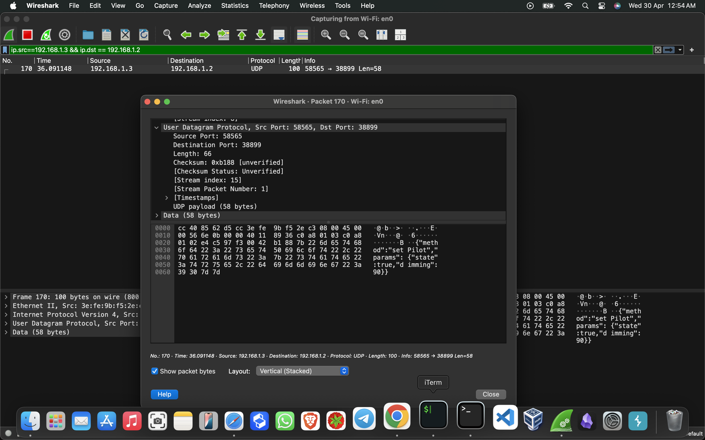

# WiZ Bulb Reverse Engineering & Control via UDP (JSON-RPC)

## 🔍 Objective
To understand and interact with a WiZ smart bulb locally on a LAN using UDP and JSON-RPC, reverse-engineering the communication protocol used by the official mobile app.

---

## 🧪 Initial Observations

- Repeated responses received from the bulb on probing:
  ```json
  {"env":"pro","error":{"code":-32700,"message":"Parse error"}}
  {"code":-32601,"message":"Method not found"}
  ```
- This indicated that the device uses **JSON-RPC** over **UDP**.

---

## 📡 Identifying the Communication Port

- UDP port **38899** was discovered to be open and used by the bulb.
- Confirmed the bulb runs a local JSON-RPC server on this port.

---

## 🧪 Basic Interaction

Used `nc` (netcat) to manually test commands:

### ✅ Get System Config
```bash
echo -n '{"method":"getSystemConfig","id":1}' | nc -u -w1 192.168.1.2 38899
```

**Sample Response:**
```json
{
  "method": "getSystemConfig",
  "id": 1,
  "env": "pro",
  "result": {
    "mac": "aBcDeFgH",
    "homeId": 12345678,
    "roomId": 87654321,
    "rgn": "eu",
    "moduleName": "ESP25_SHRGB_01",
    "fwVersion": "1.34.0",
    "groupId": 0,
    "ping": 0,
    "accUdpPropRate": 100
  }
}
```

---

## 💡 Controlling the Bulb

### 🔆 Dimming
```bash
echo -n '{"method":"setPilot","params":{"state":true,"dimming":50}}' | nc -u -w1 192.168.1.2 38899
```

### 🌈 Set Color (Red)
```bash
echo -n '{"method":"setPilot","params":{"r":255,"g":0,"b":0}}' | nc -u -w1 192.168.1.2 38899
```

---

## 🛠 Wireshark Packet Capture

Captured the UDP packet using Wireshark with filters (`ip.src`, `ip.dst`):

### Packet Screenshot (Wireshark):


---

## 🧑‍💻 Created a User-Friendly Script

Made a Bash script that lets the user:
- Enter IP and port
- Choose between system info, dimming, or color
- Send valid JSON-RPC messages to the bulb

---

## ✅ Conclusion

Successfully:
- Identified the bulb's communication protocol
- Interacted with it manually via `nc`
- Captured and analyzed packets
- Built a script to automate control

Next steps might include:
- Building a GUI interface
- Implementing more commands
- Sniffing for more advanced methods (scheduling, effects, etc.)

